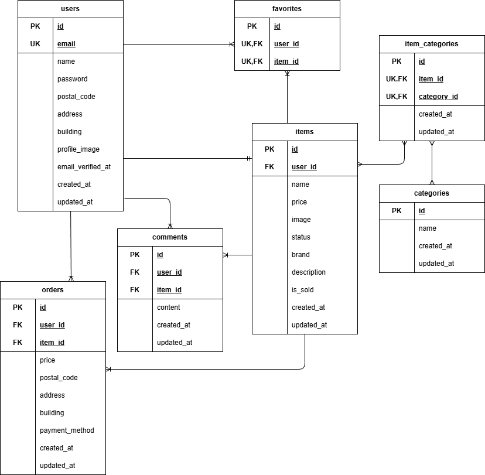

# フリマアプリ

## プロジェクト概要

このプロジェクトは、個人間で商品を売買できるフリマアプリです。
ユーザーは商品の出品、購入、コメント、お気に入り登録などの機能を利用できます。

## 主な機能

### ユーザー管理
- ユーザー登録・ログイン（Laravel Fortify）
- **メール認証機能**（メールアドレスの確認）
- プロフィール編集（プロフィール画像、郵便番号、住所、建物名）

### 商品管理
- 商品の出品（商品画像、ブランド名、カテゴリ、商品説明、価格、状態の設定）
- 商品詳細の表示
- 購入した商品、出品した商品の閲覧

### 購入・決済
- 商品の購入
- 配送先・支払方法の指定
- Stripe Checkoutによる決済

### ユーザーインタラクション
- コメント投稿・閲覧
- お気に入り登録（マイリスト）
- 商品検索

## 使用技術

### Backend
- **言語**: PHP 8.0+
- **フレームワーク**: Laravel 9
- **認証**: Laravel Fortify
- **メール認証**: Email Verification
- **メール送信テスト**: Mailhog
- **ORM**: Eloquent
- **データベース**: MySQL 8.0.26

### Frontend
- **テンプレート**: Blade
- **CSS**: レスポンシブデザイン対応（PC、タブレット）
- **メディアクエリ**: 768-850px（タブレット）

### Infrastructure
- **コンテナ化**: Docker
- **Webサーバ**: Nginx

## プロジェクト構成

```
mock-furima-app/
├── docker/                  # Docker設定
│   ├── mysql/              # MySQL設定
│   ├── nginx/              # Nginx設定
│   └── php/                # PHP設定
├── src/                    # Laravelアプリケーション
│   ├── app/
│   │   ├── Http/
│   │   │   └── Controllers/     # コントローラー
│   │   ├── Models/              # データモデル
│   │   └── Requests/            # フォームリクエスト
│   ├── database/
│   │   ├── migrations/          # マイグレーション
│   │   ├── seeders/             # シーダー
│   │   └── factories/           # ファクトリー
│   ├── public/
│   │   ├── css/                 # スタイルシート
│   │   ├── img/                 # 画像ファイル
│   │   └── storage/             # 商品画像保存先
│   ├── resources/
│   │   └── views/               # Bladeテンプレート
│   ├── routes/
│   │   └── web.php              # ルート定義
│   └── storage/                 # ログ・キャッシュ
└── docker-compose.yml      # Docker Composeファイル
```

## 🗄 ER図



### テーブル設計

#### users テーブル
ユーザー情報を管理するテーブル

| カラム | 型 | 説明 |
|-------|-----|------|
| id | INT | プライマリキー |
| name | VARCHAR | ユーザー名 |
| email | VARCHAR | メールアドレス |
| password | VARCHAR | パスワード（ハッシュ化） |
| postal_code | VARCHAR | 郵便番号 |
| address | VARCHAR | 住所 |
| building | VARCHAR | 建物名（オプション） |
| profile_image | VARCHAR | プロフィール画像パス |
| created_at | TIMESTAMP | 作成日時 |
| updated_at | TIMESTAMP | 更新日時 |

#### items テーブル
商品情報を管理するテーブル

| カラム | 型 | 説明 |
|-------|-----|------|
| id | INT | プライマリキー |
| user_id | INT | ユーザーID（外部キー） |
| name | VARCHAR | 商品名 |
| product_image | VARCHAR | 商品画像パス |
| condition | VARCHAR | 商品の状態（new, used, damaged, junk） |
| brand | VARCHAR | ブランド名 |
| description | TEXT | 商品説明 |
| price | INT | 価格 |
| is_sold | BOOLEAN | 売却フラグ |
| created_at | TIMESTAMP | 作成日時 |
| updated_at | TIMESTAMP | 更新日時 |

#### categories テーブル
商品カテゴリを管理するテーブル

| カラム | 型 | 説明 |
|-------|-----|------|
| id | INT | プライマリキー |
| name | VARCHAR | カテゴリ名 |
| created_at | TIMESTAMP | 作成日時 |
| updated_at | TIMESTAMP | 更新日時 |

#### item_categories テーブル
商品とカテゴリの関連付け（多対多）

| カラム | 型 | 説明 |
|-------|-----|------|
| id | INT | プライマリキー |
| item_id | INT | 商品ID（外部キー） |
| category_id | INT | カテゴリID（外部キー） |
| created_at | TIMESTAMP | 作成日時 |
| updated_at | TIMESTAMP | 更新日時 |
| **制約** | **UNIQUE** | **(item_id, category_id)** |

#### orders テーブル
購入情報を管理するテーブル

| カラム | 型 | 説明 |
|-------|-----|------|
| id | INT | プライマリキー |
| user_id | INT | 購入者ID（外部キー） |
| item_id | INT | 商品ID（外部キー） |
| price | INT | 購入価格 |
| postal_code | VARCHAR | 配送先郵便番号 |
| address | VARCHAR | 配送先住所 |
| building | VARCHAR | 配送先建物名（オプション） |
| payment_method | VARCHAR | 支払方法 |
| created_at | TIMESTAMP | 作成日時 |
| updated_at | TIMESTAMP | 更新日時 |

#### comments テーブル
コメント情報を管理するテーブル

| カラム | 型 | 説明 |
|-------|-----|------|
| id | INT | プライマリキー |
| item_id | INT | 商品ID（外部キー） |
| user_id | INT | ユーザーID（外部キー） |
| content | TEXT | コメント内容 |
| created_at | TIMESTAMP | 作成日時 |
| updated_at | TIMESTAMP | 更新日時 |

#### favorites テーブル
お気に入り情報を管理するテーブル

| カラム | 型 | 説明 |
|-------|-----|------|
| id | INT | プライマリキー |
| user_id | INT | ユーザーID（外部キー） |
| item_id | INT | 商品ID（外部キー） |
| created_at | TIMESTAMP | 作成日時 |
| updated_at | TIMESTAMP | 更新日時 |
| **制約** | **UNIQUE** | **(user_id, item_id)** |

### リレーション図

```
users (1) ---- (many) items
users (1) ---- (many) orders
users (1) ---- (many) comments
users (1) ---- (many) favorites

items (1) ---- (many) orders
items (1) ---- (many) comments
items (1) ---- (many) favorites

items (many) ---- (many) categories (via item_categories)
```

## 環境構築手順

### Dockerビルド
- git clone <リンク>
- docker-compose up -d --build

### Laravel環境構築
- docker-compose exec php bash
- composer install
- cp .env.example .env （環境変数を変更）
- php artisan key:generate
- php artisan migrate
- php artisan db:seed

## テストアカウント

### 一般ユーザー（動作確認用）
- **メールアドレス**: test@example.com
- **パスワード**: password

> **注意**: シーダー実行時に自動作成される8人のランダムユーザーもログイン可能です（パスワードは全て `password`）。ただし、メールアドレスはランダムなため、事前にデータベースで確認する必要があります。

## URL
- 商品一覧画面（トップ画面）：http://localhost/index
- 商品一覧画面（マイリスト）：http://localhost/index?tab=mylist
- 会員登録画面：http://localhost/register
- ログイン画面：http://localhost/login
- メール認証画面：http://localhost/email/verify
- メール確認（Mailhog）：http://localhost:8025
- 商品詳細画面：http://localhost/item/{item_id}
- 商品購入画面：http://localhost/purchase/{item_id}
- 住所変更ページ：http://localhost/purchase/address_edit/{item_id}
- 商品出品画面：http://localhost/sell
- プロフィール画面：http://localhost/mypage
- プロフィール編集画面：http://localhost/profile_edit
- プロフィール画面（購入した商品一覧）：http://localhost/mypage?page=buy
- プロフィール画面（出品した商品一覧）：http://localhost/mypage?page=sell


## レスポンシブデザイン対応

- **PC（1400px以上）**: デフォルトレイアウト
- **タブレット（768-850px）**: メディアクエリによる最適化

## メール認証機能について

### 概要
ユーザー登録後、メールアドレス確認が必須となっています。
メール認証を完了するまで、以下の機能は制限されます：
- 商品出品
- 商品購入
- コメント・お気に入り登録

**Mailhog UI**: http://localhost:8025